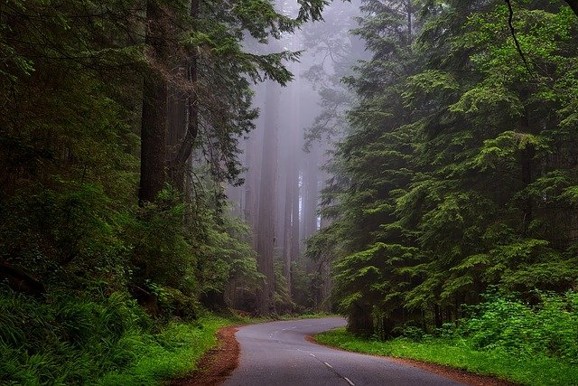

```{r setup, include=FALSE}
knitr::opts_chunk$set(echo = TRUE)
```

## R Markdown


```{r}

```


```{r}
library(ricv)

ricv(
  img1 = "./imgs/ama-dablam-g7c7ba2655_640.jpg",
  img2 = "./imgs/trees-g8dde8e6aa_640.jpg"
)
```

```{r fig.height=3}
ricv(
  img1 = "./imgs/ama-dablam-g7c7ba2655_640.jpg",
  img2 = "./imgs/sea-ge790ed96b_1280.jpg",
  options = list(addCircle = T, hoverStart = T, showLabels = T),
  css = list(both = "padding: 40px;", 
             before = "font-size: 2rem;", 
             after = "font-size: 4rem;")
)
```


